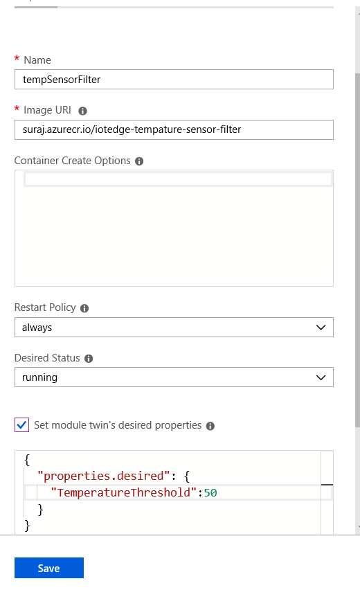

# azureEdgeSensorFilter


 ## Goal
To filter out simulated sensor data recieved based on the Temperature threshold sent as device twin
## Development Language 
 C#
## Refered from 

https://github.com/Azure/iot-edge-v1/tree/master/v2/samples/azureiotedge-simulated-temperature-sensor

## Steps to deploy as module :
1. Select a instance where docker/iotedge is configured.
2. Build a image from the dockerfile
3. Tag and push the image to repository
4. Ensure the module is configured in the Azure IoT EDGE and the container registry credentials are given

## Device Twin 

Create the device twin as in below image and save



Expect behaviour:
To sent only the filtered out temperature based on deviceTwin property to HUB
as defined in routes as 

```
{
  "routes": {
    "tempSensorFilterToIoTHub": "FROM /messages/modules/tempSensorFilter/outputs/* INTO $upstream",
    "tempSensorTotempSensorFilter": "FROM /messages/modules/tempSensor/outputs/temperatureOutput INTO BrokeredEndpoint(\"/modules/tempSensorFilter/inputs/input1\")"
  }
}
```


